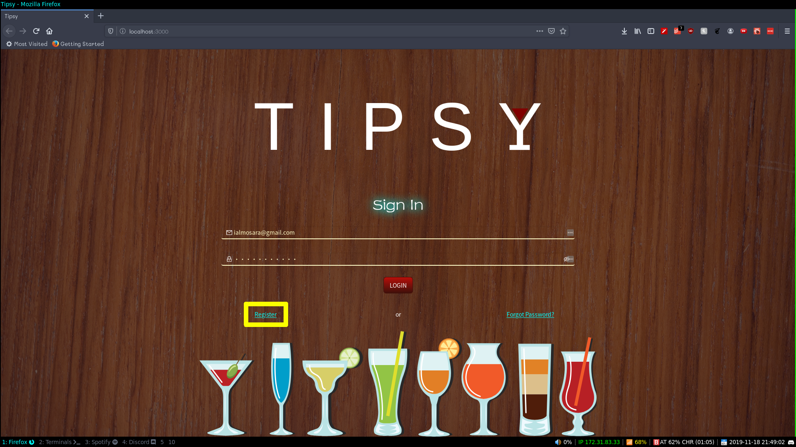
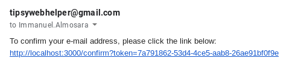
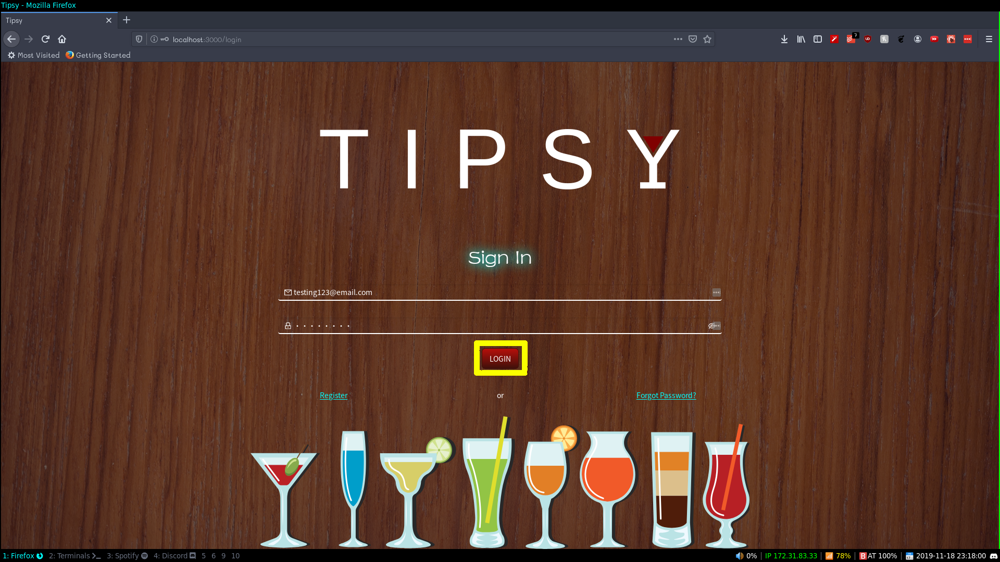
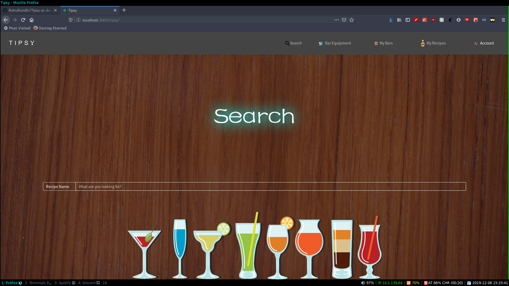
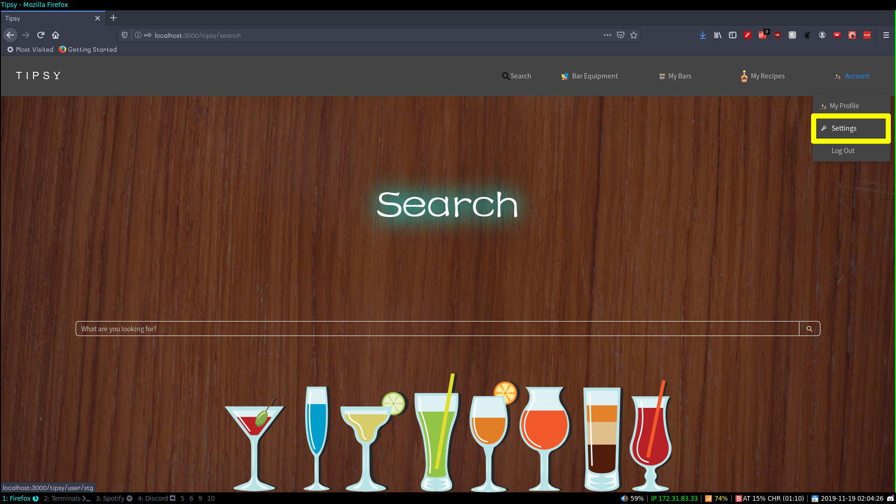
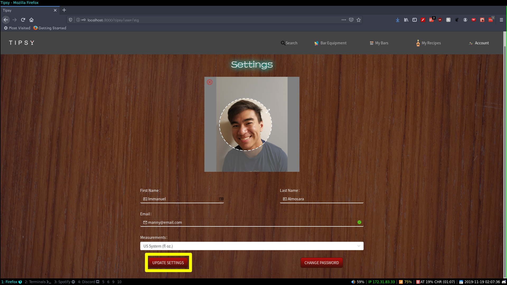
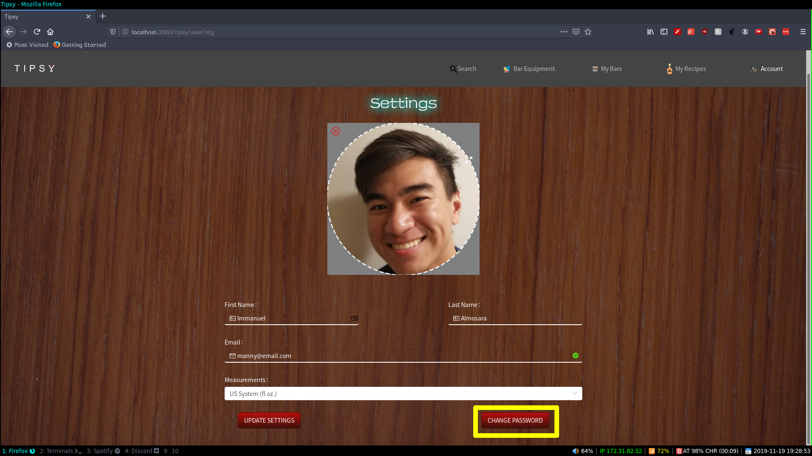
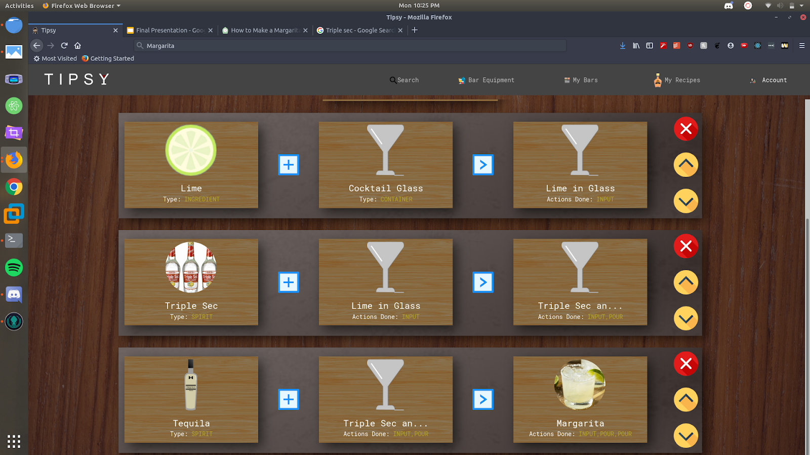

# Table of Contents
1. Register for an Account
2. Log in
3. Log Out
4. Forgot password
5. Changing user settings
6. Changing password
7. Creating a bar
8. Editing a bar
9. Deleting a bar
10. Creating a Recipe
11. Perform Recipe
12. Publishing a Recipe
13. Deleting a Recipe
14. Cloning a Recipe
15. Upload Equipment
16. Game Page
17. Step

## Features
### Register for an account
For starters, you must register for an account by clicking on the **Register** button found on the **Login** page

Afterwards you will be taken to the **Register** Page where you should fill in your credentials to create a new account:

After clicking on the submit button you will get an email sent to your email address containing a confirmation link

Upon clicking on the link your account will then be registered on the database and you will be able to Log in.

### Log In
Once you've registered for an account, you are able to **Log in**. You can do this by typing in your credentials into their respective fields and clicking on the Log In button.

Upon successfully logging in, you will be taken to the Search page where you can begin using the application.

### Log out
If you're currently logged in you can **Log out** by hovering over the **Account** tab at the top and clicking on the **Log Out** button.

### Forgot Password
If you have an account registered on the database but forgot your password, you can recover it by clicking on the **Forgot Password** button on the Login Page

Next, you type in your email and press the **Send** button.

Afterwards, in your inbox you should receive an email with a verification link. If the token that came with the link is valid then it should redirect you to the **Reset Password** page where you can type in your new password and click on **Reset**.

Lastly, if the token that came with the link is valid then it should redirect you to the **Reset Password** page where you can then change your password.

### Changing user Settings
In order to change your user settings, the user must first be logged into the application.
In order to navigate to the **Settings** page hover over the **Account** tab and click on the settings tab on the dropdown box.

Once on the **Settings** page you may edit the fields to adjust your profile information as you wish and click on the "Update Settings" button.

 

Upon updating your user settings you will see your changes applied onto your **Profile Page**:

 

### Changing Password
In order to change your password, you must first go to the **Settings** page and click on the "Change Password" button on the bottom.

 

You will then be navigated to the **Change Password** page where you will then fill in your desired password in both the "Password" and "Confirm Password" fields. If the two password match and are at least 8 characters long, you can click on the "Change Password" button to confirm your changes.

### Creating a bar
To create a bar the user must already be logged in. You must first navigate to the **My Bars** tab on the navigation bar on the top and you will be taken to the **My Bars** page where you can create, edit, or delete bars and click on the **Add A Bar** button.

Once you're on the **Create a bar** page you can change the profile photo of the bar to a photo of your choosing along with filling in the name of the Bar and including an optional description of your bar and finally pressing the **Create Bar** button to publish your newly created bar.

  

### Editing a bar
In order to edit a bar the Bar must initially exist and the user must be logged in. On the **My Bars** screen if you click on a Bar you will be taken to the Bar page for that specific Bar. From there you click on the gear icon to be taken to the **Edit Bar** page. 

Once on the page you may click on the various tabs to manage your workers, managers, and recipes associated with the bar. You can save these changes by clicking on the **Save bar** button afterwards.

If you go back to the **My Bars** screen you will see that your bar has been edited with the desired changes.

### Deleting a bar
In order to delete a bar the Bar must initially exist and the user must be logged in. On the **My Bars** screen if you click on a Bar you will be taken to the Bar page for that specific Bar. From there you click on the gear icon to be taken to the **Edit Bar** page. 

  

Once on the page you may click on the **Delete** tab and click on the **Delete** button. Afterwards you may click on the **Yes** button when prompted to delete the bar.

 

### Creating a Recipe

To create a recipe the user must already be logged in. You must first navigate to the **My Recipes** tab on the navigation bar on the top and you will be taken to the **My Recipes** page where you can create, edit, or delete recipes and click on the **Create Recipe** button.

  

Once you're on the **Create a Recipe** page you can change the profile photo of the recipe to a photo of your choosing along with filling in the name of the recipe along with an optional description of your recipe. You also can click on the various tabs to add certain pieces of equipment or Steps and finally pressing the "Create recipe" button to create your new recipe.

 

### Editing Recipe
In order to edit a recipe the user should already be logged in and the user should be the author of the recipe.

The user must click on the **My Recipes** tab on the navigation bar and click on the recipe they want to edit and click on the gear icon on the top right. From here you will be taken to the **Edit Recipe** page and you will be able to click on the various tabs to edit the recipe's steps or equipment. After making your changes you can click on the **Save Recipe** button to save your changes.

   

### Perform Recipe
Placeholder for Perform recipe

### Publishing a Recipe
In order to publish a recipe the user must be logged in, the user should own the recipe and the recipe should not already be published.

To start off the user must go on the **My Recipes** page and enter the **Recipe** page by clicking on the recipe they want to delete. Afterwards you click on the gear icon on the top right to go into the **Edit bar** page.

   

Once here you simply need to click on the **Publish** tab and click on the **Publish** button, and press yes when prompted to finalize your decision to publish your recipe.

### Deleting a Recipe
In order to delete a recipe the user must be logged in and the user should own the recipe. 

To start off the user must go on the **My Recipes** page and enter the **Recipe** page by clicking on the recipe they want to delete. Afterwards you click on the gear icon on the top right to go into the **Edit bar** page.

   

Once here you simply need to click on the **Delete** tab and click on the **Delete** button, and press yes when prompted to finalize your decision to delete your recipe.

### Cloning a Recipe
In order to clone a recipe the user should already be logged in, the recipe should exist and the recipe should be owned by the user.

In order to do this, the user must first click on the **My Recipes** tab on the navigation bar and click on the cloning icon on the top right.

   

From there you will be taken to the **Clone Recipe** page where you can make your desired changes to the cloned recipe and click on the **Clone** button to finalize your changes.

   

### Upload equipment
Uploading Custom equipment is bounded to each recipe so in this case you would need to add it through creating or editing a recipe. On either of these pages you can click on the **Equipment** tab on the right and click on the **Add your Own** button.

  

A modal will pop up and you can enter the name of the custom equipment and add its name, type, and change the picture of the equipment. After adding all your desired changes, you can click on the **Save** button.

 

Now your new piece of Equipment will be created and added to the recipe.

### Game page
The Game page is where you will take the recipes you've created and practice making your drink. You will be provided with the current step you need to perform and be given the ability to drag and drop the ingredients and select the proper units to progressively create your drink. Once you are finished performing all the steps you will be notified that you have successfully completed the recipe. If you ever perform a step incorrectly, **Tipsy** will notify you that you have done the step incorrectly and will prompt you to try again.

### Step
Steps are where your instructions for creating your recipe will go. A step comprises of two pieces of equipment along with an action, unit of measurement and amount. 

### Search
In order to perform a search, the user must be logged in.

By default once you log in you will be redirected to the **Search** page. However if you are not already on this page then you can click on the **Search** tab on the navigation bar.

From here the user can select the type of search they want to do and type in the name of the term they want to search. From here you can press the **Enter** key to query the database and your results will appear on the list of results that pop up.

