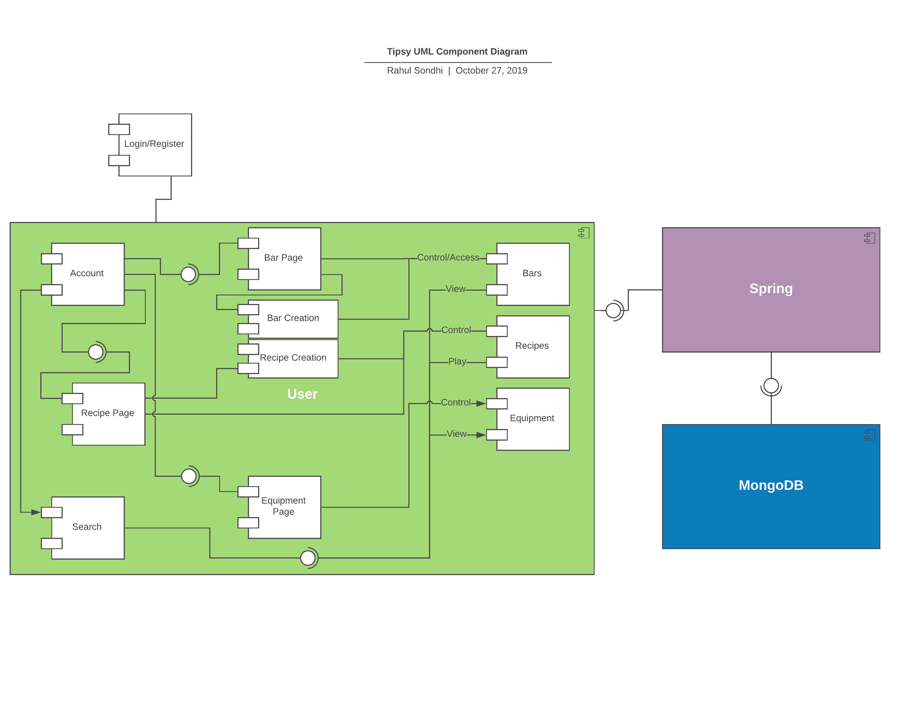

# Tipsy 
## Team 
### Lead Programmer 
## Rahul Sondhi 

### Front End Designer
### Ju-Hsin Chen

### Back End Engineer
### Bryan Valarezo

### Project Manager
### Immanuel Almosara

## Project Description
Tipsy is a Web Application for users who want to learn the art of bartending. The user will be invited to a bar, and within the bars, there will be an example recipe of actual mixed drinks the user may learn from and recipes made by other users who were in the same bar. The users may be creative and make their own drinks, or further more, create their own bar. The web application should be able to provide the service of teaching the instructions on how to make common drinks we may see in real life.
### Overview
Have you ever wanted to learn the art of bartending? What are the various tools needed to create a good drink you could serve at a bar? Given the various forms of alcohol out there, we merge our creativity alongside it. The possibilities are endless. Tipsy is designed to teach you these skills! Users will be allowed to make their own bars, where they can then invite their friends to so they can attempt to recreate their own custom made recipes. This web application will serve as a simulator for creating various drinks of your own, or it can serve as a training tool for teaching aspiring bartenders how to create their own drinks. It teaches the ins and outs of creating your favorite alcoholic drinks right in the convenience of your own web browser. 
### Technologies
The technologies we implemented in Tipsy include:
- ReactJS
- Spring Boot
- Foundation
- HTML
- CSS
- Javascript
### API Calls
- **Login POST**
-- This call handles logging in the for the user. It will send the username and password to Spring as a JSON. If the credentials are valid, Spring will then return a JSON Web Token (JWT) with a digest message containing the user session token. If the credentials are invalid, Spring will return an HTTP Bad Request code.
- **Forgot POST**
-- This call will handle the Forget Password use case. It will send an email address to Spring as a JSON. If the email address is registered in the database, Spring will generate a reset token and send an email to the address. The email will contain a link that will handle resetting the password. If the email address is not registered in the database, Spring will return with an HTTP Bad Request code.
- **Register POST**
-- This call will handle User Registration. It will send a First Name, Last Name, Email Address, Nickname, and Password to Spring as a JSON. Spring will register an account with those JSON values and it returns with an HTTP OK Request code. If any values are invalid, Spring will return an HTTP Bad Request code.
- **ValidateConfirm GET**
-- This call will handle confirming an account after registration. It requests the confirmation URL that validates the confirmation token generated during registration. Spring will then respond with a JSON that contains a boolean and a message. If the confirmation URL was valid, the user is enabled. Otherwise the confirmation URL was invalid and the user must request a new valid token.
- **ValidateReset GET**
-- This call will handle validating the reset token after the user clicks on the link after the "Forgot Password" form. It requests the reset URL and checks if the reset token sent and the reset token in the database match. Spring will then respond with a JSON that contains a boolean and message. If the URL was valid, the user will be able to reset their password. Otherwise if the reset URL is invalid, the user must request a new valid token.
- **ResetPassword POST**
-- This call will handle resetting a user's password. It sends a request for a JSON from Spring with the reset token from the reset URL and a new password. Spring will then use the token to find the User account and overwrite the password with the new one from the JSON. Spring will then set the reset token to NULL. Spring then responds with HTTP OK code. If spring was unable to reset the password, Spring will respond with an HTTP Bad request.
- **CheckEmailAvailability POST**
-- This call will handle checking if an email is already registered in the database. It sends a request with a String and Spring then checks if the provided email is already registered in the database. If the given email is already registered, then the user will not be permitted to register for an account, otherwise the user will be allowed to create a new account.
- **CheckNicknameAvailability POST**
-- This call will handle checking if a nickname is already registered in the database. It sends a request with a String and Spring then checks if the provided nickname is already reigstered in the database. If the nickname is already registered, then the user will not be allowed to register for an account with that nickname, otherwise the user will be allowed to create a new account.
- **GetCurrentUser GET**
-- This call will handle returning a JSON containing a UserSummary Object that holds the user ID, nickname, and name. The value that is returned will return a user based on the JWT Token, if no user is found then the function returns nothing. 
## Documentation
### Overview
For creating the UI Mockups we used the program Abobe XD. To create our UML Diagrams we used LucidChart.  For creating the SRS Document we used Google Docs.
### UI Mockups
https://github.com/RahulSondhi/SBUCSCapstoneProject/blob/master/Documentation/UIMockUps/Tipsy.xd
### UML Diagrams
#### Class Diagram

#### Component Diagram

#### Package Diagram

### SRS Document
https://github.com/RahulSondhi/SBUCSCapstoneProject/blob/master/Documentation/SRSDocument/CSE308%20SRS.docx
### Progress Reports

# Build Process and Work Flow

### Team Procedures
Our team has utilized various tools to ensure that our progress continues at a steady rate. In regards to organization we used Trello and TeamGantt to properly delegate our work evenly. For staying connected we created a group chat in Facebook Messenger. For organizing meetings we used When2Meet to quickly find a time where all members were available to schedule an appropriate time to hold a meeting.

### Rules for committing
We as a group have collectively decided to only make commits once a significant amount of progress has been made and to be descriptive in each commit.

