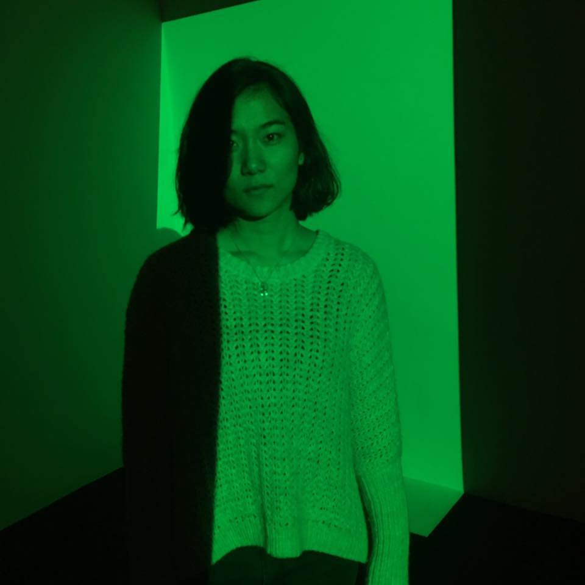

# Tipsy
## Team
### Lead Programmer
Rahul Sondhi

### Front End Designer
Ju-Hsin Chen

### Back End Engineer
Bryan Valarezo

### Project Manager
Immanuel Almosara

## Project Description
	Tipsy is a Web Application for users who want to learn the art of bartending. The user will be invited to a bar, and within the bars, there will be an example recipe of actual mixed drinks the user may learn from and recipes made by other users who were in the same bar. The users may be creative and make their own drinks, or further more, create their own bar. The web application should be able to provide the service of teaching the instructions on how to make common drinks we may see in real life.
### Overview
	Have you ever wanted to learn the art of bartending? What are the various tools needed to create a good drink you could serve at a bar? Given the various forms of alcohol out there, we merge our creativity alongside it. The possibilities are endless. Tipsy is designed to teach you these skills! Users will be allowed to make their own bars, where they can then invite their friends to so they can attempt to recreate their own custom made recipes. This web application will serve as a simulator for creating various drinks of your own, or it can serve as a training tool for teaching aspiring bartenders how to create their own drinks. It teaches the ins and outs of creating your favorite alcoholic drinks right in the convenience of your own web browser. 
### Technologies
The technologies we implemented in Tipsy include:
- ReactJS
- Spring Boot
- Foundation
- HTML
- CSS
- Javascript
### API Calls
- Login POST
- Forgot POST
- Register POST
- ValidateConfirm GET
- ValidateReset GET
- ResetPassword POST
- Confirm POST
## Documentation
### Overview
### UI Mockups
### UML Diagrams
### SRS Document
### Progress Reports
