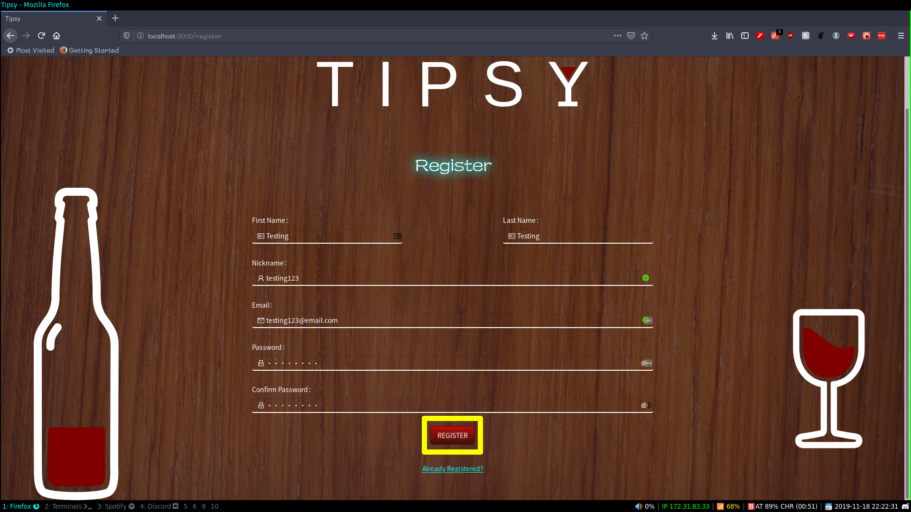
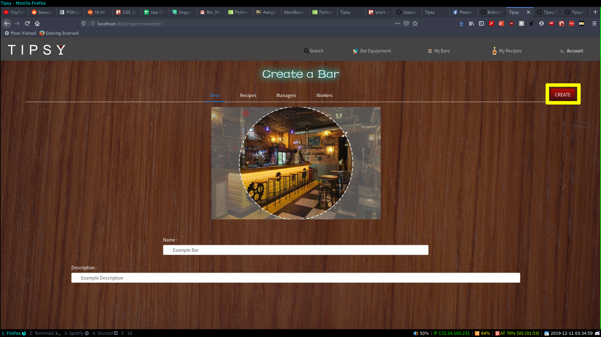
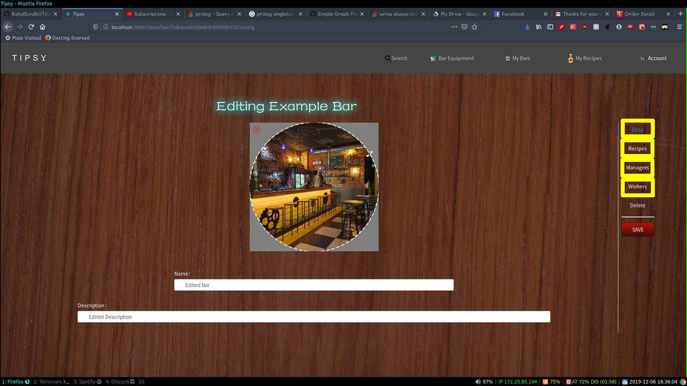
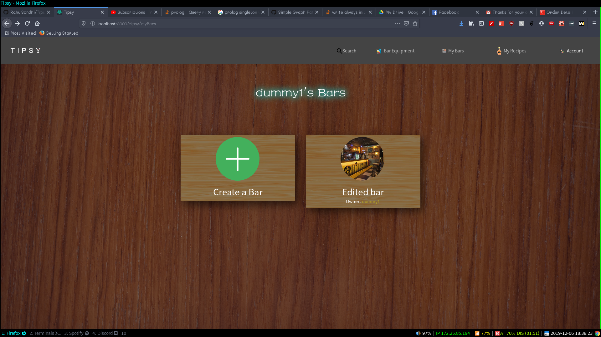
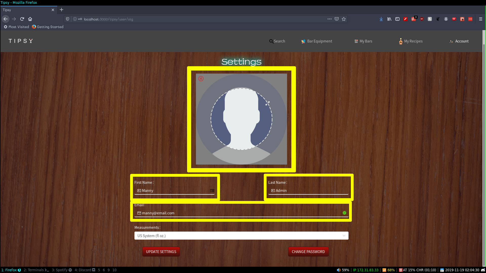
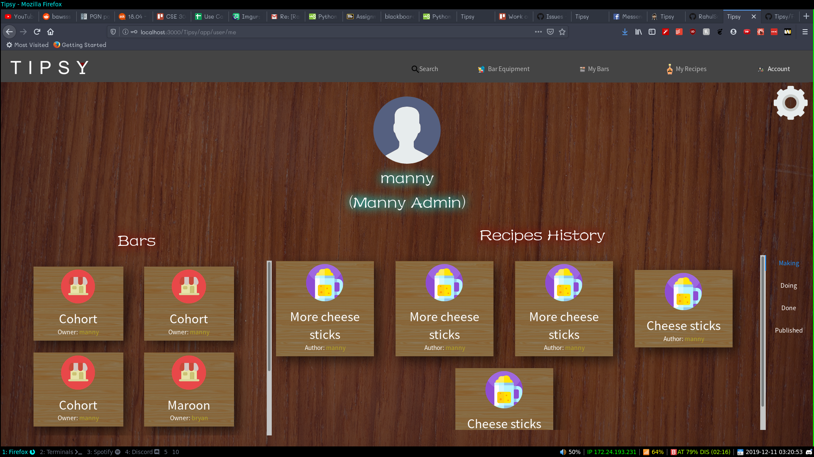
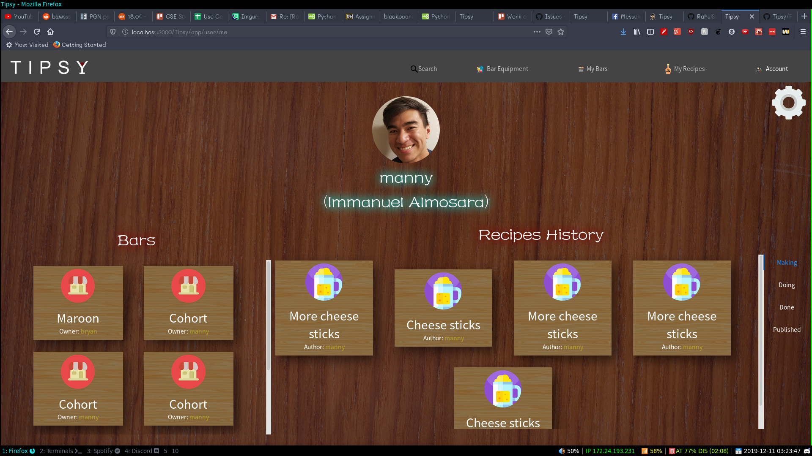
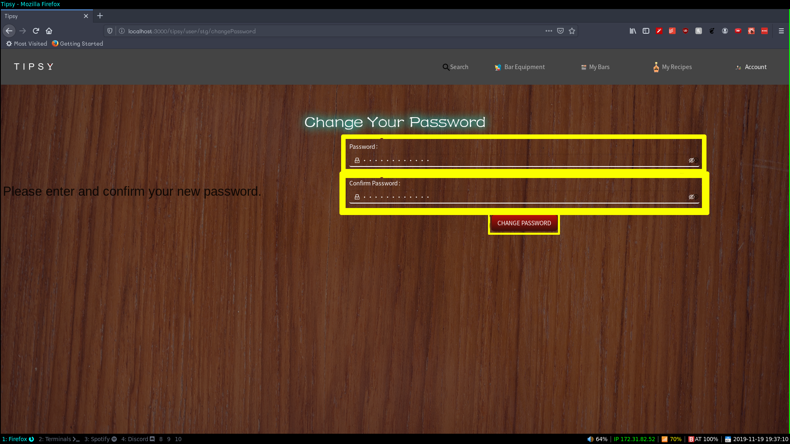

# Tipsy 
## Team 
### Lead Programmer - Rahul Sondhi

The lead programmer will have their hands full because in addition to their own coding responsibilities, they will need to have a general understanding of all the technologies being used and all the implementation work being done at any time. The lead programmer will be responsible for directing group decision-making regarding any technical aspects of the project, including design, implementation, and test decisions.

### Front End Designer- Ju-Hsin Chen

The Front End Designer is responsible for the look and feel, including interactivity, of the Web app. 

### Back End Engineer - Bryan Valarezo

The Data Designer is responsible for the data persisted to your site's database. This means deciding what needs to be stored there and in what format to put it, and then making decisions regarding how to setup the database, how to update it, and how to make sure proper data is preserved and reset when necessary.

### Project Manager - Immanuel Almosara

The project manager drives the project, which means working with the lead programmer to direct the meetings (i.e. make the meeting agenda, assign action items, follow up on action items, take meeting minutes), develop the Project Specifications, help divide project responsibilities, develop Gantt and Pert Charts for managing work measurement, forecasting, task breakdown, task assignment, and task dependencies.

## Project Description
Tipsy is a Web Application for users who want to learn the art of bartending. The user will be invited to a bar, and within the bars, there will be an example recipe of actual mixed drinks the user may learn from and recipes made by other users who were in the same bar. The users may be creative and make their own drinks, or further more, create their own bar. The web application should be able to provide the service of teaching the instructions on how to make common drinks we may see in real life.

### Overview
Have you ever wanted to learn the art of bartending? What are the various tools needed to create a good drink you could serve at a bar? Given the various forms of alcohol out there, we merge our creativity alongside it. The possibilities are endless. Tipsy is designed to teach you these skills! Users will be allowed to make their own bars, where they can then invite their friends to so they can attempt to recreate their own custom made recipes. This web application will serve as a simulator for creating various drinks of your own, or it can serve as a training tool for teaching aspiring bartenders how to create their own drinks. It teaches the ins and outs of creating your favorite alcoholic drinks right in the convenience of your own web browser. 

### Technologies
The technologies we implemented in Tipsy include:
- ReactJS
- Spring Boot
- Foundation
- HTML
- CSS
- Javascript

### API Calls
- **Login POST**
-- This call handles logging in the for the user. It will send the username and password to Spring as a JSON. If the credentials are valid, Spring will then return a JSON Web Token (JWT) with a digest message containing the user session token. If the credentials are invalid, Spring will return a 400 HTTP Bad Request status code.
- **Forgot POST**
-- This call will handle the Forget Password use case. It will send an email address to Spring as a JSON. If the email address is registered in the database, Spring will generate a reset token and send an email to the address. The email will contain a link that will handle resetting the password. If the email address is not registered in the database, Spring will return with a 400 HTTP Bad Request status code.
- **Register POST**
-- This call will handle User Registration. It will send a First Name, Last Name, Email Address, Nickname, and Password to Spring as a JSON. Spring will register an account with those JSON values and it returns with a 200 HTTP OK Request status code. If any values are invalid, Spring will return a 400 HTTP Bad Request status code.
- **VerifyConfirm GET**
-- This call will handle confirming an account after registration. It requests the confirmation URL that validates the confirmation token generated during registration. Spring will then respond with a JSON that contains a boolean and a message. If the confirmation URL was valid, the user is enabled. Otherwise the confirmation URL was invalid and the user must request a new valid token.
- **VerifyReset GET**
-- This call will handle verifying the reset token after the user clicks on the link after the "Forgot Password" form. It requests the reset URL and checks if the reset token sent and the reset token in the database match. Spring will then respond with a JSON that contains a boolean and message. If the URL was valid, the user will be able to reset their password. Otherwise if the reset URL is invalid, the user must request a new valid token.
- **VerifyNewEmail GET**
-- This call will handle verifying a new email that a user has set on their account. It sends a token and the new email associated with the current user to Spring. Spring then generates a timestamp of the current time and finds the user associated with the token. From there it firstly checks if 24 hours has passed since the token was generated to see if it's expired. If it is then Spring returns a 410 HTTP Gone status code. Otherwise Spring will set the new email of the user to the new email, clears the token, saves the changes onto the database and sends a 200 HTTP OK status code. If any errors take place along the way, Spring returns a 500 Internal Server error status code.
- **ResetPassword POST**
-- This call will handle resetting a user's password. It sends a request for a JSON from Spring with the reset token from the reset URL and a new password. Spring will then use the token to find the User account and overwrite the password with the new one from the JSON. Spring will then set the reset token to NULL. Spring then responds with a 200 HTTP OK status code. If spring was unable to reset the password, Spring will respond with a 400 HTTP Bad Request status code.
- **ChangePassword POST**
-- This call will handle changing a user's password. It  sends a new password to Spring in the form of a JSON. Spring will then take that password and overwrite the password for the current user. If successful, it returns a 200 HTTP OK  Request response status code. Otherwise, Spring returns a 400 Bad Request response status code.
- **CheckEmailAvailability GET**
-- This call will handle checking if an email is already registered in the database. It sends a request with a String and Spring then checks if the provided email is already registered in the database. If the given email is already registered, then the user will not be permitted to register for an account, otherwise the user will be allowed to create a new account.
- **CheckNicknameAvailability GET**
-- This call will handle checking if a nickname is already registered in the database. It sends a request with a String and Spring then checks if the provided nickname is already reigstered in the database. If the nickname is already registered, then the user will not be allowed to register for an account with that nickname, otherwise the user will be allowed to create a new account.
- **GetCurrentUser GET**
-- This call will handle retrieving the current User. The client sends a token to Spring, where Spring then parses the token, decrypts it, then authenticates it and pulls the ID, email, nickname, and roles of the user. The value that is returned will return a user based on the JWT Token, if no user is found then the function returns nothing.
- **CreateNewBar POST**
-- This call will handle creating a new Bar. Spring will receive a barRequest object containing a bar name, description, image, list of managers, list of workers, and list of recipes available for that bar. Spring will then gather a full list of users affiliated with that bar and create a new bar object with the tokens provided in the barRequest object. Finally, Spring will add the Bar to each of the users and save it to the database. If successful, Spring will return a 200 HTTP OK response status code. Otherwise, Spring will return a 500 HTTP Internal Server Error status code.
- **GetBarProfile GET**
-- This call will handle pulling a Bar profile from the database. Spring will receive a barID variable and pull the Bar object from the database and gather all the information including: name, description, a base64 encoded image, owner, managers, workers, and recipes associated with the bar. If successful, Spring returns a 200 HTTP OK response status code with an object containing all these tokens. Otherwise Spring returns a 500 HTTP Internal Server Error status code.
- **ChangeBarSettings POST**
-- This call will handle changing the settings of a Bar. Spring first checks if the current user is either the owner or a manager of the Bar. The Owner gets full access in terms of changing the Bar settings, which includes: managing Managers, Workers, and Recipes. However, if the current user is a Manager then they are allowed to manage Workers and Recipes, but not other Managers. In either case once the settings are saved Spring returns a 200 HTTP OK response status code. If the current user is neither the Owner nor a Manager, then Spring returns a 401 HTTP Unauthorized status code. If there is an error that comes up along the process then Spring returns a 500 Internal Server Error status code.
- **DeleteBar POST**
-- This call will handle deleting a Bar. Spring takes in a barID as well as the current user. If the user is the Owner of the Bar then they are given permission to delete the Bar. Otherwise, Spring returns a 401 HTTP Unauthorized response status code. Spring pulls the Bar from the repository and removes it from all Users associated with it, then deletes the Bar from the Bar repository and returns a 200 HTTP OK response status code. If any internal errors take place along the way, Spring returns a 500 HTTP Internal Server Error status code.
- **GetEquipmentProfile GET**
-- This call will handle returning a specific piece of Equipment from the database. Spring takes in the name of the piece of Equipment and pulls the Equipment object from the database and pulls: the name, base64 encoded image, type, list of Actions done by the Equipment and a list of Actions done to the Equipment. If successful, Spring returns a 200 HTTP OK status code. Otherwise, Spring returns a 500 HTTP Internal Server Error status code.
- **GetAllEquipment GET**
-- This will handle pulling a full list of all equipment from the database. Spring will access the Equipment repository and gather a full list of details from each piece of equipment containing a name, image, and type. If successful, Spring returns a 200 HTTP OK status code. Otherwise, Spring returns a 500 HTTP Internal Server Error status code.
- **CreateRecipe POST**
-- This call will handle creating a new Recipe. Spring takes in a RecipeRequest JSON object that contains a name, description, base64 encoded image, whether it has been published or not, the list of Step objects, the list of Equipment objects, and two boolean variables indicating whether the user has edited the steps or equipment in the Recipe. From there, Spring will compile a new Recipe object to add to the database based on the JSON provided and saves it to the database. If successful, Spring returns a 200 HTTP OK status code. Otherwise, Spring returns a 400 HTTP Bad Request status code.
- **GetRecipeProfile GET**
-- This call will handle returning a specific Recipe from the database. Spring takes in the current user and the name of the recipe ID the user is trying to pull. Spring first verifies that the Recipe exists on the database and that the current user is the owner of the Recipe. If the recipe is published or if the ID of the owner of the Recipe doesn't match the current user then the user is denied access and Spring returns a 404 HTTP Not found status code. Otherwise Spring builds the author, list of steps, and list of equipment and compiles that along with the recipe information to build a RecipeResponse object. If successful, Spring returns a 200 HTTP OK status code along with the Recipe Response object. If errors are found along the way, then Spring returns a 500 Internal Server error status code.
- **GetStep GET**
-- This call will handle returning the Step object from a specific Recipe. Spring takes in the current user, recipe ID, and the index of the requested step. The Recipe is pulled from the database, and Spring checks if the Recipe is found in the user's list of incompleted Recipes. It retrieves the step fro, the recipe, and returns a StepResponse object along with a 200 HTTP OK status code. If the list isn't found in the user's list of incompelted Recipes then Spring returns a 401 HTTP Unauthorized status code. If any other errors take place along the way then Spring returns a 500 HTTP Internal Server Error status code. 
- **ChangeRecipeSettings POST**
-- This call will handle changing the settings of a given Recipe. Spring takes in the Recipe ID, the current user, and a RecipeRequest JSON. Spring checks if the current user is an author of the Recipe or an Admin. If not, Spring returns a 401 HTTP Unauthorized status code. Otherwise, Spring proceeds to retrieve the Recipe that matches the recipe ID provided from the database and apply the changes from the RecipeRequest object to the Recipe in the database. Spring updates the name, description, base64 encoded image, whether it has been published or not, the list of steps, and the list of equipment. If successful, Spring saves the updated Recipe onto the database and returns a 200 HTTP OK status code. If Spring runs into any errors, it returns a 500 HTTP Internal Server error status code.
- **DeleteRecipe POST**
-- This call will handle deleting a Recipe. Spring takes in a recipe ID along with the current user. If the current user is an admin or an author of the recipe, then Spring will disassociate the Recipe from the user, delete all the steps from the Recipe, and deletes the Recipe itself. Afterwards, Spring returns a 200 HTTP status code. If not, then Spring returns a 401 HTTP Unauthorized status code. If any other errors take place, then Spring returns a 500 HTTP Internal Server Error status code.
- **GetAllUnits GET**
-- This will handle retrieving the list of units. Spring pulls all the Units form the Unit repository and adds a UnitResponse object containing the name of the unit, and their equivalent measurements in milliliters and fluid ounces. Afterwards, Spring returns a 200 HTTP OK status code along with a JSON containing a list of units. If any internal errors take place along the way, Spring returns a 500 HTTP Internal Server Error.
- **GetUserProfile GET**
-- This will handle retrieving a User profile. Spring takes in a nickname as input and matches it to a User in the User repository. It gathers the name, profile picture, first name, last name, Recipes written, Recipes completed, and incomplete Recipes done by the user. Afterwards Spring returns a 200 HTTP OK status code along with the JSON compiled from these tokens. If any internal errors take place along the way, Spring returns a 400 HTTP Bad Request status code.
- **ChangeUserSettings POST**
-- This call will handle changing User settings. Spring takes in a request object that contains the edits made by the User to their settings. Spring overwrites the previous values it had stored with the new changes. For changing an email, the previously set email address will receive a notification email saying that the email will be changed, and the new email will receive a verification email to confirm the email change. The changes are saved to the User object and Spring returns a 200 HTTP OK status code. If any internal errors take place along the way, Spring returns a 400 HTTP Bad Request status code.
- **GetUserSettings GET**
--  This will handle retrieving the current User's settings. Spring pulls the current user and maps it to a User on the database. From there Spring creates a JSON that contains the user's first name, last name, email, base64 encoded profile picture, and set measurement. Afterwards Spring returns a 200 HTTP OK status code. If any internal errors take place along the way, Spring returns a 400 HTTP Bad Request status code.

## Documentation
### Overview
We are using an Agile Software Engineering strategy. This means planning a build schedule, specifying the necessary use case implementations for each build, developing a maleable system design using UML Class diagrams, and then reviewing progress and updating the schedule as needed. 

### UI Mockups
This is a UI Mockup created in Adobe XD to show how the site is to desgined.
#### 
### UML Class Diagram
This is a UML Class Diagram which maps out the structure of our system by modeling its classes, attributes, operations, and relationships between objects. This was created using Lucidcharts.

### UML Component Diagram
This is a UML Component Diagram which is integral to building our software systembecause it helps the team understand the structure of the system we are trying to build. This was created using Lucidcharts.

### UML Package Diagram
This is a UML Package Diagram which simplifies the complex class diagrams and helps create/show the hiearchy and dependencies for our system. This was created using Lucidcharts. 

### SRS Document
This is a software requirements specification (SRS) which is a document that describes what the software will do and how it will be expected to perform. This was created in Google Documents.
#### 

## Build Process/Work Flow
### Team Communication/Organization
Our team has utilized various tools to ensure that our communication continues through the project. In regards to organization we used Trello and TeamGantt to properly delegate our work evenly. For staying connected we created a group chat in Facebook Messenger. For organizing meetings we used When2Meet to quickly find a time where all members were available to schedule an appropriate time to hold a meeting.
### Project Checking Procedure
To ensure the project doesn't crash or fail at anytime or interval, we utilize Git Branches to maintain work flow. This allows our team member to work at the same time on the project without causing issues to each other. This ensures the project doesnt randomly start crashing for others and no merge conflicts remove others' code. Before a push to main branch, the group is given a headsup and everything is saved and stashed before hand. The person merging is responsible for doing a quality check of master and making sure no functions were broken. In order to accomadate lack of experience in git, people on the team who are not familiar with git commandline are using git kraken. 
### Rules for committing
We as a group have collectively decided to only make commits once a significant amount of progress has been made or before merging of any branches. The description of the commit is to be detailed and summarizing of all changes made with the commit. We refrain our team from making multiple small commits back to back.
### Rules of the Database
The database will be only handled by the Data Designer to prevent any problems arising. The format of data going in and out of database are set by data designer. Our team can request changes in data schema and format, but the data designer is the only one to implement those changes unless team member was given permission to change themself. The data within database will only be dropped with the approval of the data designer.
### Making Changes to Project Plan 
The team meets weekly to do check-ins on everyones assigned tasks and sections. If there is a disagreement on how something is implemented, team members will converse about solutions that will result in a compromise. No change is discussed without proper reasoning given first. The other members of the team have the ability to veto an implementation if atleast 2 of 3 other members severly disagree with the current setup. An agenda is created 2 days prior to each meeting day to ensure that the topics that need to be discussed are mentioned during the meeting.

##Installation
To launch **Tipsy** you must clone our repository using the command
------------

	git clone https://github.com/RahulSondhi/Tipsy.git
From there you must switch into the /scripts/run-scripts/ directory 

From there run the install & run scripts to properly install all the dependencies and launch the program using the following commands in your terminal:

	cd scripts/run-scripts
	./install.sh
	./run.sh

When you launch the script your default browser will open at localhost:3000 and you will be taken to the Login screen

##Features
###Register for an account
For starters, you must register for an account by clicking on the **Register** button found on the **Login** page

Afterwards you will be taken to the **Register** Page where you should fill in your credentials to create a new account:

After clicking on the submit button you will get an email sent to your email address containing a confirmation link

Upon clicking on the link your account will then be registered on the database and you will be able to Log in.

###Log In
Once you've registered for an account, you are able to **Log in**. You can do this by typing in your credentials into their respective fields and clicking on the Log In button.

Upon successfully logging in, you will be taken to the Search page where you can begin using the application.

###Creating a Bar
To create a Bar you must first navigate to the "My Bars" tab on the navigation bar on the top and you will be taken to the **My Bars** page where you can create, edit, or delete Bars and click on the **Add A Bar** button.

Once you're on the **Create a Bar** page you can change the profile photo of the bar to a photo of your choosing along with filling in the name of the Bar and including an optional description of your bar and finally pressing the "Create Bar" button to publish your newly created bar.

  

###Editing a Bar
In order to edit a Bar the bar must initially exist. On the **My Bars** screen if you click on a Bar you will be taken to the Bar page for that specific Bar. From there you click on the gear icon to be taken to the **Edit Bar** page. 

Once on the page you may click on the various tabs to make your edits to the bar and have the changes saved by clicking on the "Save Bar" button.

If you go back to the **My Bars** screen you will see that your bar has been edited with the desired changes.

###Changing User Settings
In order to change your user settings, the user must first be logged into the application.
In order to navigate to the **Settings** page hover over the **Account** tab and click on the settings tab on the dropdown box.

Once on the **Settings** page you may edit the fields to adjust your profile information as you wish and click on the "Update Settings" button.

 

Upon updating your user settings you will see your changes applied onto your **Profile Page**:
 

###Changing Password
In order to change your password, you must first go to the **Settings** page and click on the "Change Password" button on the bottom.

 

You will then be navigated to the **Change Password** page where you will then fill in your desired password in both the "Password" and "Confirm Password" fields. If the two password match and are at least 8 characters long, you can click on the "Change Password" button to confirm your changes.

 